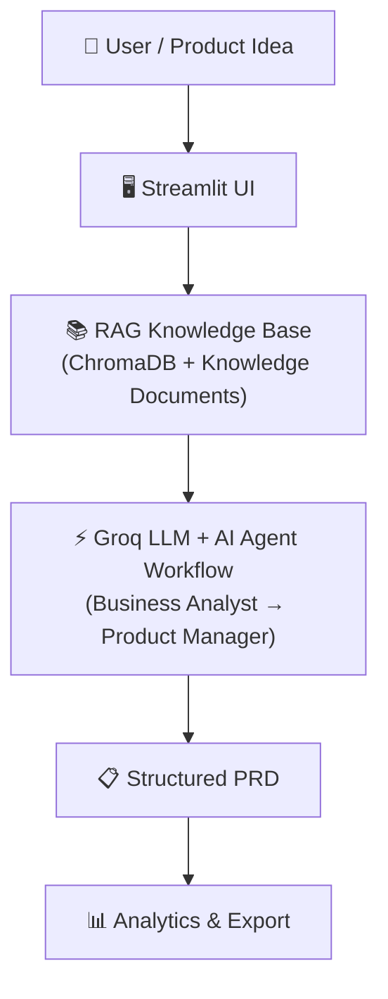

# 📋 AI Product Requirement Generator

An intelligent, multi-agent artificial intelligence application designed to transform high-level product concepts into comprehensive, execution-ready **Product Requirement Documents (PRDs)**. Built with **LangChain**, **Groq Cloud LPUs**, **ChromaDB Vector Store (RAG)**, and an interactive **Streamlit** user interface.

---

## 🚀 Live Demo

Try the deployed application:

[AI PRD Generator – Live Demo](https://ai-prd-generator-006.streamlit.app/)

---

## 📌 Problem Statement

In modern software development and agile product workflows, drafting comprehensive Product Requirement Documents (PRDs) is often:
- **Time-Consuming**: Product managers and founders spend days researching, formatting, and structuring specifications.
- **Prone to Omissions**: Critical non-functional requirements (NFRs) like latency benchmarks, accessibility compliance (WCAG), data security standards, and disaster recovery are frequently overlooked.
- **Misaligned Between Business & Engineering**: Business rationale and user pain points are often disconnected from technical acceptance criteria and risk matrices.
- **Inconsistent in Quality**: Varying author experience leads to ambiguous user stories lacking concrete acceptance criteria.

---

## 💡 Solution Overview

The **AI Product Requirement Generator** bridges the gap between vision and technical execution by employing a **collaborative dual-agent pipeline** enriched with **Retrieval-Augmented Generation (RAG)**:

1. **Business Analyst (BA) Agent**: Conducts problem decomposition, market opportunity evaluation, competitive positioning, and crafts 2 rich user personas.
2. **Product Manager (PM) Agent**: Translates the BA's findings into INVEST user stories with Gherkin acceptance criteria (`Given/When/Then`), MoSCoW-prioritized functional requirements, engineering NFRs across 5 dimensions, and an actionable risk mitigation matrix.
3. **RAG Vector Grounding**: Every prompt is grounded with industry standards retrieved semantically from a local **ChromaDB** vector database to eliminate hallucinated formats and enforce rigorous engineering best practices.

---

## 🌟 Key Features

- **Collaborative Dual-Agent Pipeline**: Role-specialized agents (BA + PM) working sequentially with separation of concerns.
- **RAG-Grounded Accuracy**: Semantic search against curated knowledge base documents (`prd_standards.md`, `nfr_guidelines.md`, `risk_framework.md`).
- **Blazing-Fast Inference via Groq**: Accelerated inference using Groq LPUs running modern reasoning models (`llama-3.3-70b-versatile`, `openai/gpt-oss-120b`, `qwen/qwen3.6-27b`).
- **Dedicated PRD Results Page**: Multi-view architecture separating the Input workflow from a dedicated, distraction-free Results page.
- **Live Pipeline Loading State**: Immediate visual feedback with an animated loading card and progress updates during agent synthesis.
- **Dynamic Quality & Scope Analytics**: Metrics calculated directly from the generated document:
  - 📝 **Total Words**
  - 👥 **Personas Count**
  - 📌 **User Stories Count**
  - ⚙️ **Functional Requirements Count**
  - ⚠️ **Risk Items Count**
- **Deep Document Workspace**: 8 discrete tabs (Full PRD, Executive Summary & Scope, Personas, User Stories, Functional Specs, NFRs & SLAs, Risk Matrix, and RAG Knowledge Trace).
- **Multi-Format Document Exports**: One-click downloads for **Markdown (`.md`)**, **Printable HTML (`.html`)**, and **JSON (`.json`)**.
- **WCAG-Compliant Visual Design System**: Dedicated Light and Dark modes engineered for high contrast and readability.
- **Quick-Start Demo Presets**: Pre-loaded product concepts (Campus Food Delivery, Student Budget Tracker, AI Mental Health Companion, Skill Swap Marketplace) for instant demonstrations.

---

## 🏗️ System Architecture & Workflow



### High-Level Workflow Breakdown
1. **User / Product Idea**: The user inputs the product concept, target domain, and optional technical constraints.
2. **Streamlit UI**: Coordinates the user experience across dedicated input and results views with real-time generation feedback.
3. **RAG Knowledge Base**: Retrieves domain-specific engineering standards, NFR guidelines, and risk frameworks semantically from local ChromaDB storage.
4. **Groq LLM + AI Agent Workflow**:
   - **Business Analyst (BA) Agent**: Conducts problem decomposition, market analysis, and user persona creation.
   - **Product Manager (PM) Agent**: Translates business context into INVEST user stories, functional requirements, NFRs, and risk matrices.
5. **Structured PRD**: Assembles an industry-standard, execution-ready document.
6. **Analytics & Export**: Derives real-time document quality metrics and provides one-click exports in Markdown, HTML, and JSON formats.

---

## 🤖 AI Models & Groq LPU Integration

- **Inference Engine**: [Groq Cloud](https://console.groq.com/), offering real-time token streaming and sub-second generation times.
- **Dynamic Model Discovery**: Automatically inspects the user's Groq environment and presents available models (e.g., `llama-3.3-70b-versatile`, `openai/gpt-oss-120b`, `qwen/qwen3.6-27b`, `openai/gpt-oss-20b`).
- **Prompt Isolation**: System instructions are decoupled into distinct templates (`src/agents/prompts.py`) enforcing INVEST criteria, Gherkin syntax, MoSCoW prioritization, and five specific NFR dimensions.

---

## 📚 RAG & ChromaDB Grounding

The RAG subsystem eliminates hallucinated structures by injecting verified templates into the LLM context:
- **Embedding Model**: `sentence-transformers/all-MiniLM-L6-v2` (runs 100% locally on CPU without external API costs).
- **Vector Database**: `ChromaDB` (persistent local vector index located in `.chroma_db/`).
- **Knowledge Base Documents**:
  1. [`data/knowledge_base/prd_standards.md`](data/knowledge_base/prd_standards.md): Industry standards for user stories, INVEST principles, and acceptance criteria.
  2. [`data/knowledge_base/nfr_guidelines.md`](data/knowledge_base/nfr_guidelines.md): Non-functional dimensions covering Performance, Scalability, Security, Usability, and Reliability.
  3. [`data/knowledge_base/risk_framework.md`](data/knowledge_base/risk_framework.md): Standard risk matrix frameworks, probability/impact scoring, and mitigation taxonomies.

---

## 🛠️ Technologies Used

| Layer | Technology | Purpose |
| :--- | :--- | :--- |
| **Frontend & UI** | [Streamlit](https://streamlit.io/) | Web dashboard, reactive state, custom CSS themes |
| **Agent Orchestration** | [LangChain](https://www.langchain.com/) | LLM prompt templates, runnable chains, output parsing |
| **LLM Provider** | [Groq](https://groq.com/) | High-throughput LPU inference for fast document generation |
| **Vector Store** | [ChromaDB](https://www.trychroma.com/) | Local persistent vector storage for RAG retrieval |
| **Embeddings** | [Hugging Face Sentence-Transformers](https://huggingface.co/sentence-transformers/all-MiniLM-L6-v2) | Local 384-dimensional dense semantic embeddings |
| **Configuration** | [python-dotenv](https://github.com/theskumar/python-dotenv) | Secure local environment key management |
| **Data Validation** | [Pydantic](https://docs.pydantic.dev/) | Structured data integrity and schema validation |

---

## 📂 Project Structure

```
AI-Product-Requirement-Generator/
├── data/
│   └── knowledge_base/               # Knowledge docs for RAG grounding
│       ├── nfr_guidelines.md         # Non-Functional Requirements benchmarks
│       ├── prd_standards.md          # Best practices for PRDs & INVEST stories
│       └── risk_framework.md         # Risk assessment & mitigation taxonomy
├── src/
│   ├── __init__.py
│   ├── config.py                     # App configuration & dynamic model resolver
│   ├── agents/
│   │   ├── __init__.py
│   │   ├── ba_agent.py               # Business Analyst agent chain
│   │   ├── pm_agent.py               # Product Manager agent chain
│   │   ├── prd_generator.py          # End-to-end dual-agent pipeline coordinator
│   │   └── prompts.py                # Specialized prompts for BA and PM agents
│   ├── rag/
│   │   ├── __init__.py
│   │   ├── retriever.py              # Semantic context retriever
│   │   └── vector_store.py           # ChromaDB document ingestion & embeddings
│   └── utils/
│       ├── __init__.py
│       └── export_utils.py           # Section parser, metric counters & exporters
├── tests/
│   ├── test_e2e_comprehensive.py     # 7-stage end-to-end verification suite
│   ├── test_pipeline_dryrun.py       # Pipeline simulation test
│   └── test_rag.py                   # ChromaDB retrieval unit test
├── .env.example                      # Safe template for local configuration
├── .gitignore                        # Comprehensive GitHub ignore rules
├── app.py                            # Streamlit web application & multi-view UI
├── README.md                         # Project documentation
└── requirements.txt                  # Python dependencies
```

---

## 🚀 Getting Started (Run Locally)

### 1. Prerequisites
- **Python 3.10 to 3.12** installed on your system.
- A free **Groq API Key** from the [Groq Console](https://console.groq.com/).

### 2. Clone the Repository
```bash
git clone https://github.com/your-username/AI-Product-Requirement-Generator.git
cd AI-Product-Requirement-Generator
```

### 3. Set Up a Virtual Environment
```bash
# Windows (PowerShell)
python -m venv venv
.\venv\Scripts\Activate.ps1

# macOS / Linux
python3 -m venv venv
source venv/bin/activate
```

### 4. Install Dependencies
```bash
pip install -r requirements.txt
```

### 5. Configure Environment Variables
Create a local `.env` file in the root directory by copying the template:
```bash
# Windows (PowerShell)
Copy-Item .env.example .env

# macOS / Linux
cp .env.example .env
```
Edit `.env` and paste your Groq API key:
```env
GROQ_API_KEY=gsk_your_actual_groq_api_key_here
```
> [!NOTE]
> The `.env` file is excluded from Git via `.gitignore` to keep your credentials secure.

### 6. Launch the Application
```bash
streamlit run app.py
```
Open your browser and navigate to:
```
http://localhost:8501
```

---

## 🧪 Testing & Verification

The repository includes a comprehensive 7-stage automated verification suite:

```bash
python tests/test_e2e_comprehensive.py
```

### Test Coverage Breakdown
1. **Source Syntax & Compilation**: Verifies clean bytecode compilation of all Python files.
2. **Knowledge Base & Vector Store**: Validates knowledge documents and semantic RAG retrieval.
3. **Agent Prompt Templates**: Checks prompt interpolation and role definitions.
4. **Section Parsing**: Confirms discrete extraction across all 8 PRD sections.
5. **Dynamic Metrics Verification**: Tests item counting (Words, Personas, Stories, FRs, Risks) across 3 distinct product PRDs.
6. **Exporters**: Validates HTML and JSON serialization.
7. **Model Discovery & Theme CSS**: Verifies Groq model resolution and WCAG CSS injection for Light and Dark modes.

---

## 📄 License
This project is open-source under the MIT License. Created for academic, portfolio, and engineering demonstration purposes.
